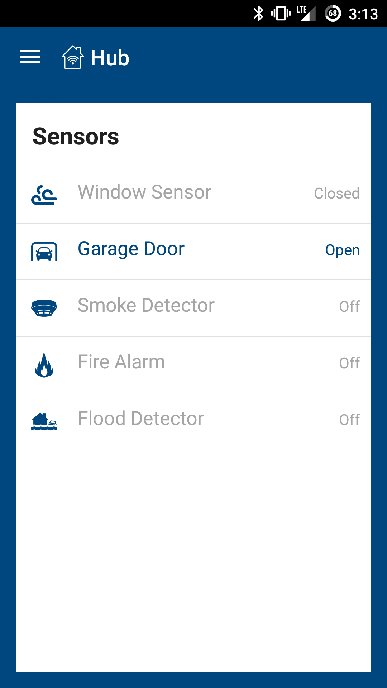
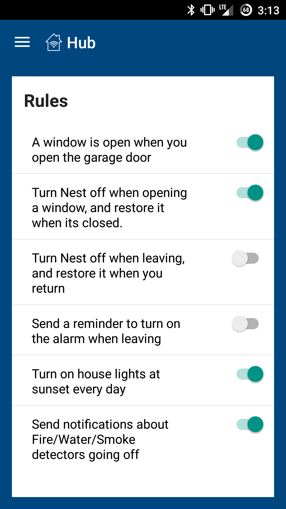
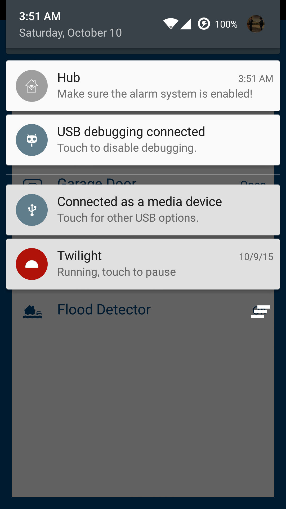
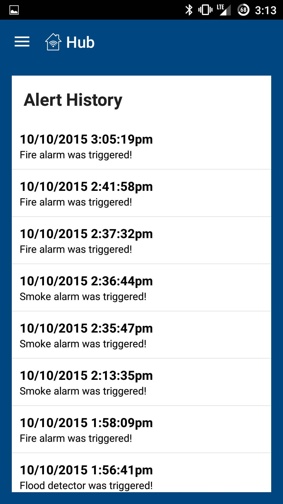

# Allstate Hub - Android

A home filled with sensors makes it have the potential to do a lot of cool events. However, isolated, these sensors can accomplish little. If the sensors in the smart home are allowed to connect with one another, they can do a lot more. Gathering information from a variety of sensors and smart devices throughout the house, the Allstate Hub connects a variety of different sensors and devices to provide an easy-to-use interface for a homeowner to manage their place of residence.

Screenshots below:

